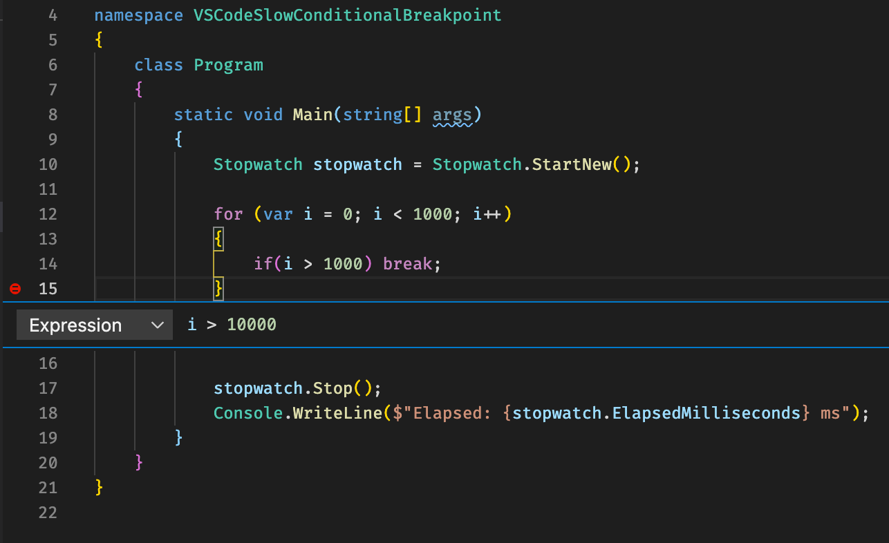

The conditionals breakpoints calculated very slow. As a result, a one-sec loop could grow to tens of minutes. It goes to pain when you make a remote debugging using a channel with high latency.

#### Steps ####
1. Run code with a simple breakpoint. It works as expected, and 1000 cycles spun in a few ms on my 2,6 GHz laptop.

1. Add unreachable breakpoint with expression at the end of the loop. Not inside If condition, otherwise it will not be calculated, and the issue will not be reproducible. It takes ~7-8 sec.

