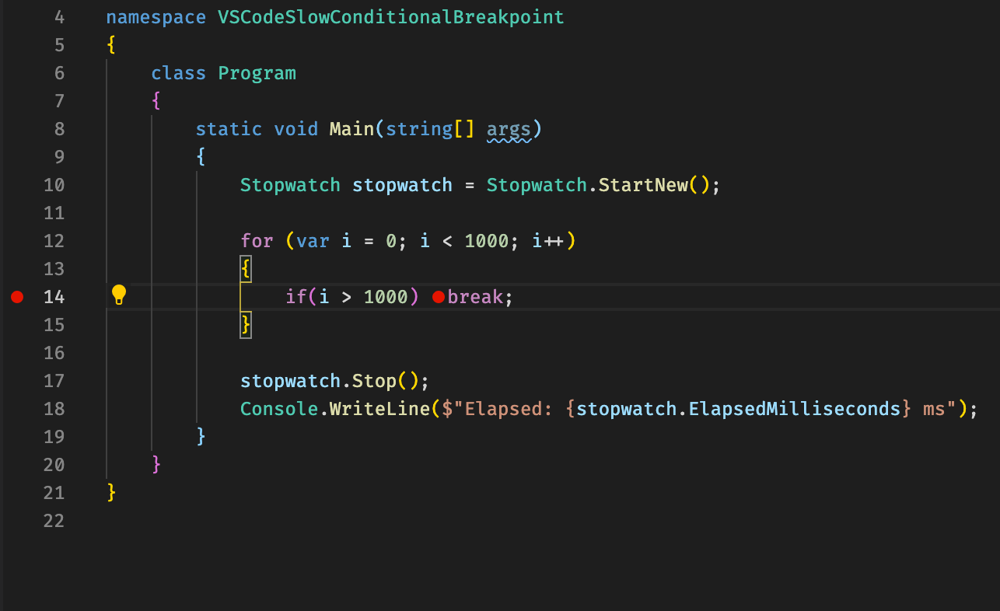

The conditionals breakpoints calculated very slow. As a result, a one-sec loop could grow to tens of minutes. It goes to pain when you make a remote debugging using a channel with high latency.

#### Steps ####
1. Run code with a simple breakpoint. It works as expected, and 1000 cycles spun in a few ms on my 2,6 GHz laptop.

1. Add unreachable breakpoint with expression at the end of the loop. Not inside If condition, otherwise it will not be calculated, and the issue will not be reproducible. It takes ~7-8 sec.

### Tests: ###
Native time < 1 ms, same with a simple breakpoint on both 2.6 GHz laptop and 3.2 GHz pc.
With conditional breakpoint, the elapsed time is 7-8 sec on laptop and 6-7 on pc.
I tested for VS Code and Visual Studio. They showed the same results, no difference.

### Latency test: ###
Environment: new windows 10 inside Parallels VM on 2.6 GHz vCPU. 
Result: Same 5-6 sec with conditional breakpoint and without latency. 
The remote debugging with network conditioner to 500 ms latency same result.

### Resume: ###
The performance of conditional breakpoints in VS Code is good for local and SSH Remote mode. It's comparable to local debugging with Visual Studio exclude network latency. The debugger doesn't add instruction to the compiled code and needs to stop the process and switch context to calculate a condition. It costs ~7 ms for a 2.6 GHz CPU